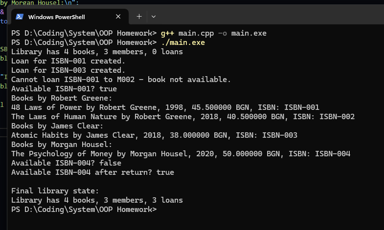

Проект Библиотека - Library

Описание - проектът представлява малък C++ проект, който изпълнява работата на малка функционираща библиотека.
Той използва главни концепции на ООП в езика - конструктури и деструктури, капсулация и достъп до скрити данни чрез getters и setters,
също както и валидация на данним, и добри практики на ООП.

Структура на проекта:

    OOP Homework/
        ├── Author.h
        ├── Book.h
        ├── Library.h
        ├── Loan.h
        ├── Member.h
        ├── main.cpp
        └── README.txt

Начин на компилация:

    1. Отворете директорията, в която се намират всички файлове на проекта.
    2. Компилирайте мейн метода чрез кода - g++ main.cpp -o main.exe
    3. Ръннете файла като напишете - ./main.cpp

Класове:

    Autor:

        Представя автор с име и година на раждане

        Членове:

            std::string name — име на автора
            int birthYear — година на раждане

        Методи:

            Author() — конструктор по подразбиране, задава "Unknown" и 1900
            Author(const std::string &n, int y) — параметризиран конструктор със списък за инициализация
            getName() — връща името на автора
            getBirthYear() — връща годината на раждане
            setBirthYear(int y) — задава година на раждане с проверка (1900–2025)
            to_string() — връща текстово описание на автора

    Book:

        Представя книга с основните ѝ характеристики и брояч на всички създадени обекти

        Членове:

            std::string title — заглавие
            Author author — автор на книгата
            int year — година на издаване
            double price — цена
            std::string isbn — ISBN код
            static int totalBooks — брояч на всички създадени обекти от тип Book

        Методи:

            Book() — конструктор по подразбиране
            Book(const std::string &t, const Author &a, int y, double p, const std::string &i) — параметризиран конструктор със списък за инициализация
            Book(const Book& other) — копиращ конструктор
            Book(Book&& other) — преместващ конструктор
            operator=(const Book& other) — копиращ оператор за присвояване
            operator=(Book&& other) — преместващ оператор за присвояване
            ~Book() — деструктор, намалява броя на книгите
            getTitle() — връща заглавието на книгата
            getAuthor() — връща автора на книгата
            getYear() — връща годината на издаване
            getPrice() — връща цената
            getISBN() — връща ISBN кода
            setYear(int y) — задава година с проверка (1750–2050)
            setPrice(double p) — задава цена с проверка за неотрицателност
            to_string() — връща текстово описание на книгата
            static getTotalBooks() — връща броя на създадените книги
    
    Member:

            Представя член на организация с основни характеристики

            Членове:

                std::string name — име на члена
                std::string memberId — идентификатор на члена
                int yearJoined — година на присъединяване

            Методи:

                Member() — конструктор по подразбиране
                Member(const std::string &n, const std::string &id, int y) — параметризиран конструктор със списък за инициализация
                setMemberId(std::string id) — задава идентификатор, ако не е празен
                getName() — връща името на члена
                getMemberId() — връща идентификатора
                getYearJoined() — връща годината на присъединяване
                to_string() — връща текстово описание на члена

    Loan:

        Представя заем на книга с основни характеристики и статус на връщане

        Членове:

            std::string isbn — ISBN код на заетата книга
            std::string memberId — идентификатор на члена, който е заел книгата
            std::string startDate — начална дата на заема
            std::string dueDate — крайна дата за връщане
            bool returned — флаг дали книгата е върната

        Методи:

            Loan(const std::string &i, const std::string &m, const std::string &s, const std::string &d) — параметризиран конструктор със списък за инициализация, проверява дали dueDate е след startDate
            markReturned() — отбелязва, че книгата е върната
            isOverdue(const std::string& today) — проверява дали заемът е просрочен спрямо подадена дата
            getISBN() — връща ISBN кода на книгата
            getMemberId() — връща идентификатора на члена
            isReturned() — връща дали книгата е върната
            to_string() — връща текстово описание на заема

    Library:
            Представя библиотека с книги, членове и активни заеми

            Членове:

                std::vector<Book> books — колекция от книги
                std::vector<Member> members — колекция от членове
                std::vector<Loan> loans — колекция от заеми

            Методи:

                addBook(const Book& b) — добавя книга в библиотеката
                addMember(const Member& m) — добавя член в библиотеката
                hasBook(const std::string& isbn) — проверява дали библиотеката съдържа книга с даден ISBN
                isBookAvailable(const std::string& isbn) — проверява дали книгата е налична за заем
                loanBook(const std::string& isbn, const std::string& memberId, const std::string& start, const std::string& due) — извършва заем на книга, ако е налична
                returnBook(const std::string& isbn, const std::string& memberId) — отбелязва връщането на книга
                findByAuthor(const std::string& authorName) — връща списък с книги от автор, чието име съдържа дадения низ
                to_string() — връща текстово описание на библиотеката с брой книги, членове и заеми

Екранна снимка:

Автор:

Име: Никола Иванов; 
Номер: 22521 
Курс: Обектно-ориентирано програмиране (C++)
Дата: 12/1/2025;

